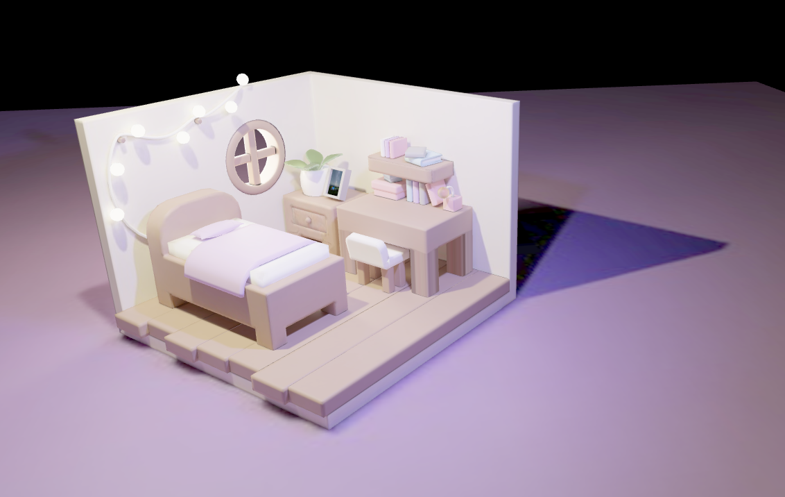
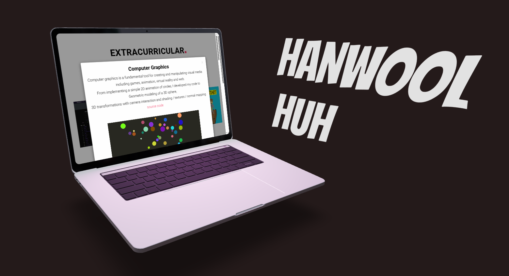

# Three.js Projects
This repository contains a collection of interactive 3D web projects built using Three.js.

## 1. 3D Text
This project demonstrates how to create dynamic 3D text using TextGeometry in Three.js. A custom material is applied to the text to give it depth and realism. Additionally, randomly distributed torus meshes ("donuts") are rendered around the text for a more engaging visual effect.

[3D Text](https://hello-everyone-opal.vercel.app/)

## 2. 3D Model (Blender)
In this project, a full 3D room scene is modeled in Blender, with materials and lighting baked into textures. The exported model (.glb) is loaded into a Three.js scene using GLTFLoader, allowing efficient rendering of complex geometry and realistic textures.

[Room Modelling](https://room-modelling.vercel.app/)

## 3. 3D Portfolio
This scene features a 3D laptop model with its screen displaying an actual portfolio website via an iframe overlay. The laptop model is imported and positioned to look natural, giving the illusion of browsing the portfolio directly from the 3D environment.

[Laptop Portfolio](https://laptop-portfolio-two.vercel.app/)
